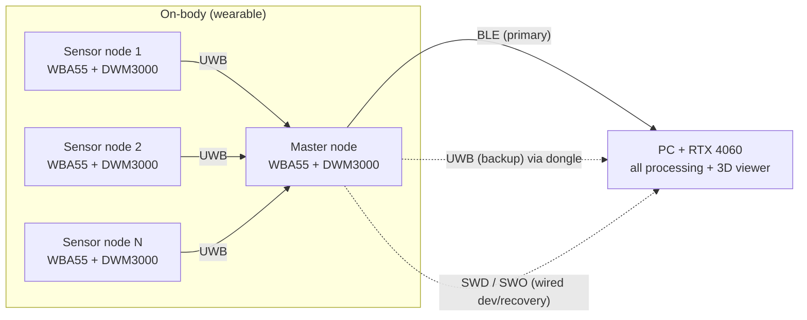
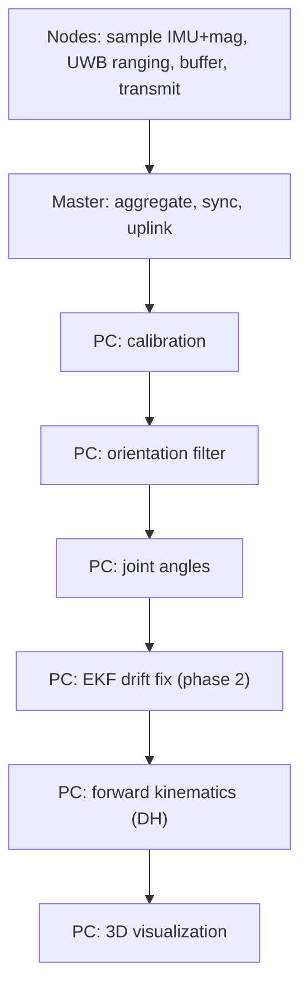

# Wearable IMU — Project Master README

> Wearable IMU-based motion-capture system for **live upper-limb pose estimation**.
> Summer research project (IIT Chicago), with the goal of publishing.
>
> This document is the single source of truth for the system architecture, hardware,
> communication design, processing pipeline, and repository structure. It is written
> so it can be handed to **Claude Code** (or any collaborator) to scaffold and build
> the project. See [How to use this document](#how-to-use-this-document) at the end.

---

## 1. Project overview

A network of small body-worn **IMU nodes** streams motion data to a **PC**, which reconstructs
and displays a live 3D skeleton of the upper limb. The design philosophy is **thin nodes,
heavy PC**: nodes only sample and transmit; all fusion, kinematics, and visualization run on
the PC (which has an RTX 4060 GPU).

| Item | Decision (v1) |
|------|----------------|
| Focus | Upper limb |
| Output | Live joint angles + 3D skeleton visualization |
| Nodes | Scalable design; initial bring-up on **3 nodes** (one arm), scaling to **6–8** |
| Sample rate | **100 Hz** target (hardware capable to 200 Hz) |
| Environment | Lab / bench (PC present in the room) |
| Compute | All heavy processing on the PC, **not** on a body MCU |
| Reference work | *Ultra Inertial Poser* (UIP), SIGGRAPH 2024 — see [References](#10-references) |

---

## 2. System architecture

All nodes use **identical hardware** (STM32WBA55 + DWM3000). One node is designated the
**master** purely in firmware. Because the boards are identical, multiple transport
topologies can be tested and compared on the same hardware (a useful experimental result).

### Primary topology



- **On-body UWB network** carries node data to the master, provides **time sync**, and
  (phase 2) provides **inter-node ranging** for drift correction.
- **Master node** aggregates all node data and is the single uplink to the PC.
- **PC** runs the full pipeline and the live visualization.

### Where the work happens



> **v1 needs no Kalman filter.** Orientation → joint angles → DH skeleton → render is a
> complete working visualization. The EKF (with UWB distances) is a phase-2 enhancement
> for drift and position.

---

## 3. Transports & fallbacks

Every node has **two radios (BLE + UWB)** plus onboard flash, giving multiple independent
paths to the PC. Layered strategy:

| Layer | Path | Role |
|-------|------|------|
| Live primary | BLE (master → PC, native or via nRF52840 USB dongle) | Main wireless link |
| Live backup | UWB → UWB-USB dongle | Independent RF path (different band) |
| Wired | **SWD / SWO** via ST-LINK | Bench/dev + data recovery (one-way out) |
| Insurance | **W25Q64** per-node logging | No data loss even if all live links fail; recovered over SWD |

Notes:
- BLE uses **serial-over-BLE** (a transparent UART-style GATT service / NUS-equivalent), so
  it behaves like a wireless UART. An **nRF52840 USB dongle** can present it to the PC as a
  COM port.
- **SWD is a 10-pin connector**; SWO gives a one-way MCU→PC data channel through the ST-LINK
  (read via SWV tooling). This replaces the earlier USB-UART bridge idea (no CP2102N).
- **USB-C still charges** the battery (handled by the BQ25185, independent of the MCU). The
  WBA55 has **no native USB**, so USB-C is charging-only.
- RAM ring buffer (~seconds) covers jitter/retransmit; a >3–5 s dropout is treated as a
  compromised session regardless, so heavy persistence is unnecessary.

---

## 4. Hardware — Node BOM

Single identical board for every node. (No on-node SD card.)

| Function | Part | Notes |
|----------|------|-------|
| MCU | **STM32WBA55CG** (UFQFPN48, e.g. STM32WBA55CGU7) | Cortex-M33 @ 100 MHz, BLE 5.4, 1 MB flash, 128 KB SRAM, SESIP Level 3. Drives DWM3000 over SPI. |
| IMU | **LSM6DSV16BXTR** | 6-axis, onboard SFLP sensor fusion |
| Magnetometer | **MMC5983MA** | Separate 3-axis → makes the node 9-DOF. Populated but **optional** (use TBD) |
| UWB | **DWM3000** | Data transport + sync + (phase-2) inter-node ranging |
| Local flash | **W25Q64JVXGIM** (8 MB) | RAM-buffer backstop + no-loss session insurance |
| SMPS (+3V3) | **TPSM828224** | |
| Battery charger | **BQ25185** | Charges from USB-C VBUS |
| Fuel gauge | **MAX17048G_T10** | |
| Power button | **STM6601BM2DDM6F** | |
| USB-C | Right-angle 16P | **Charging only** (no MCU USB) |
| Debug/data | **10-pin SWD connector** | SWD + SWO (data out / flash recovery) |
| Indicator | LED | |
| Battery | LiPo, ~300–600 mAh | **Not final** — may shrink to ~300 mAh |

### PC-side hardware

| Function | Part | Notes |
|----------|------|-------|
| BLE receiver | PC-native Bluetooth, or **nRF52840 USB dongle** | Dongle preferred if native BLE proves unreliable; presents as COM port |
| UWB backup receiver | UWB-USB dongle (DWM3000 + USB MCU) | Optional, for the UWB fallback path |
| Compute | PC with **RTX 4060** | Runs full pipeline + visualization |

---

## 5. Communication & protocols

### Data format (per node, per sample)
- **Option A (preferred for the rig): raw 9-DOF** — accel(3) + gyro(3) + mag(3) + timestamp.
  Maximum flexibility; host does all fusion. ~40 bytes/sample.
- **Option B: SFLP quaternion** (from the LSM6DSV16B) + raw mag. Smaller, less host work.
- **Decision: open** (see [Open items](#11-open-items--tbd)). Magnetometer rate can be lower
  (e.g., 50–100 Hz).

### Bandwidth (single BLE uplink, aggregated)
- ~**230 kbps** for 8 nodes raw @ 100 Hz — comfortable for one BLE 5.x link.
- ~**460 kbps** @ 200 Hz — feasible but near the edge of reliable laptop BLE. → run v1 at 100 Hz.

### UWB on-body scheduling
- One channel does **data slots + ranging rounds + sync** via a **TDMA frame**.
- Ranging is slow relative to data: **25–50 Hz** is plenty.
- All-pairs ranging scales as N(N-1)/2 (15 pairs @ 6 nodes, 28 @ 8). For upper-limb joint
  angles, **adjacent-segment pairs** may suffice — full mesh not required.

### Sync
- The master is the UWB time reference; nodes are sub-ns aligned **on the body, before**
  data leaves. Master timestamps aggregated data.

---

## 6. Processing pipeline (PC)

| Stage | Purpose | Maps to known technique |
|-------|---------|--------------------------|
| 0. Calibration | Sensor-to-segment alignment (T/N-pose) | — |
| 1. Orientation filter | accel+gyro(+mag) → world-frame quaternion | complementary / Madgwick / VQF (or use SFLP) |
| 2. Joint angles | relative rotation between adjacent segments | rotation matrices / quaternions |
| 3. EKF (phase 2) | fuse UWB inter-node distances → fix drift / get positions | Kalman filter (new) |
| 4. Forward kinematics | joint angles + segment lengths → 3D skeleton | **Denavit-Hartenberg** |
| 5. Visualization | live render of links/joints | 3D viewer |

- **v1 path:** stages 0 → 1 → 2 → 4 → 5 (no EKF).
- **Phase 2:** insert stage 3 (EKF + UWB ranging) for drift/position.
- A **synthetic data generator** (or arm-simulator rig) can drive the pipeline before
  hardware is ready.

---

## 7. Build phases / roadmap

1. **Firmware + data path** — node sampling, UWB schedule, master aggregation, PC ingest.
   Bring up over **SWD/SWO (wired)** first (familiar tooling), then add BLE as a parallel path.
2. **Visualization program** — orientation → joint angles → DH skeleton → live 3D render.
   Develop against **synthetic data** first. No Kalman filter needed.
3. **EKF** — learn the Kalman filter (from complementary-filter intuition) and fold in the
   UWB inter-node distances for drift/position.

> BLE de-risking: prove the entire system over wired (SWD/SWO) first; learn BLE in isolation
> on a NUCLEO-WBA55CG with ST's serial-over-BLE example; then integrate with the wired path
> still available as a safety net.

---

## 8. Repository structure (proposed)

```
wearable-imu/
├── README.md                      # this file
├── docs/                          # markdown source of truth (export to Word/PDF as needed)
│   ├── 01-system-overview.md
│   ├── 02-hardware.md
│   ├── 03-firmware.md
│   ├── 04-communication-protocols.md
│   ├── 05-algorithms-pipeline.md
│   ├── 06-pc-software.md
│   ├── 07-calibration-testing.md
│   └── 08-appendices.md
│
├── firmware/
│   └── node/                      # single firmware, master role selected at runtime/build
│       ├── Core/                  # CubeMX-generated (HAL, startup, clock)
│       ├── App/
│       │   ├── app_main.c/.h
│       │   ├── role_master.c/.h   # aggregation + BLE uplink
│       │   └── role_sensor.c/.h   # sample + UWB tx
│       ├── Drivers/
│       │   ├── lsm6dsv16b/        # IMU driver
│       │   ├── mmc5983ma/         # magnetometer driver
│       │   ├── dwm3000/           # UWB driver
│       │   └── w25q64/            # flash driver
│       ├── Comms/
│       │   ├── uwb_tdma.c/.h      # TDMA frame: data + ranging + sync
│       │   ├── ble_serial.c/.h    # serial-over-BLE service
│       │   └── swo_data.c/.h      # SWO/ITM data out + flash dump
│       ├── Sensors/
│       │   ├── imu.c/.h
│       │   ├── mag.c/.h
│       │   └── fusion.c/.h        # optional on-node fusion
│       ├── Power/
│       │   ├── charger.c/.h       # BQ25185
│       │   └── fuel_gauge.c/.h    # MAX17048
│       └── config.h               # node id, role, sample rate, format flags
│
├── pc/
│   └── wearable_imu/              # Python package (the live pipeline)
│       ├── ingest/                # serial / BLE / UWB readers
│       ├── sync/                  # timebase alignment
│       ├── orientation/           # filters (complementary / Madgwick / VQF)
│       ├── kinematics/            # joint angles + DH forward kinematics
│       ├── ekf/                   # phase 2: UWB-distance fusion
│       ├── viz/                   # 3D skeleton viewer
│       ├── sim/                   # synthetic data generator for dev
│       ├── config.py
│       └── main.py
│
├── tools/
│   ├── flash/                     # programming / provisioning scripts
│   └── capture/                   # SWO / serial / BLE capture utilities
│
├── calibration/                   # calibration routines + saved profiles
├── hardware/                      # schematics, BOM, layout (reference only)
└── tests/
```

---

## 9. Design decisions log (the "why")

- **MCU = STM32WBA55** (over the earlier L431 / U535): the master needs BLE; identical
  BLE-capable boards let any node be master and enable topology testing. WBA55 is M33,
  ultra-low-power (good for a small battery), and SESIP3-certified (useful for a publishing /
  compliance story). Trade-off: no native USB — covered by SWD/SWO for wired data.
- **Master-aggregator + single BLE uplink** (vs UIP's per-node BLE): one BLE link instead of
  N (avoids PC multi-link flakiness) and gives tighter on-body sync.
- **BLE primary + UWB backup:** two independent RF paths. BLE (2.4 GHz) is more robust to
  body blocking than UWB (6.5–8 GHz); UWB is reserved for ranging where it's irreplaceable.
- **PC does all heavy compute** (not a body MCU): the pipeline (and future ML) is GPU/
  desktop work, and PC-side iteration is far faster than reflashing firmware.
- **No on-node SD card:** RAM buffer + W25Q64 insurance instead; avoids tedious card
  extraction; recovery happens over SWD.
- **SWD/SWO for wired data** (instead of a USB-UART bridge): reuses an existing connector,
  drops the CP2102N, and the ST-LINK is already needed for flashing.
- **100 Hz for v1:** matches UIP and is sufficient for full-body pose; keeps BLE bandwidth
  comfortable.

---

## 10. References

- **Ultra Inertial Poser (UIP), SIGGRAPH 2024** — sparse body-worn IMU + UWB inter-node
  ranging, fused on a host with VQF orientation, per-pair EKF, an LSTM + graph-conv network,
  and a physics dynamics optimizer to produce full-body pose.
  - **This project mirrors** the IMU + UWB sensing approach and the "thin nodes, host does
    the work" philosophy.
  - **This project differs:** adds a magnetometer (9-DOF vs UIP's 6-DoF); uses a
    master-aggregator UWB→BLE topology (vs UIP's per-node BLE to host); focuses on upper-limb
    joint angles + live visualization for v1; EKF/ranging is a phase-2 enhancement.

---

## 11. Open items / TBD

- **Data format:** raw 9-DOF vs SFLP quaternion + raw mag.
- **Magnetometer:** whether to use it (characterize the lab's magnetic environment first;
  hardware is populated either way).
- **Battery:** final capacity (300–600 mAh).
- **Node count for tests:** 3 (single arm) → 6–8.
- **Sample rate:** confirm 100 Hz (vs 200 Hz).
- **Dongle:** PC-native BLE vs nRF52840 dongle; whether to build the UWB backup dongle.
- **EKF scope:** confirm phase-2 (not v1).

---

## How to use this document

1. Keep this README and the `docs/` folder as the **markdown source of truth** (version with
   git). Use **Mermaid** for all diagrams so they edit as text and render in GitHub/VS Code.
2. To produce a polished copy for the team/professor, export markdown → Word/PDF (e.g., with
   Pandoc, which renders the Mermaid diagrams to images). Don't hand-maintain two copies.
3. To scaffold the project, hand this file to **Claude Code** and ask it to create the
   repository structure in [Section 8](#8-repository-structure-proposed), generating stub
   files with the responsibilities described here.
4. Build in the phase order of [Section 7](#7-build-phases--roadmap): wired data path first,
   then visualization (synthetic data), then BLE, then the EKF.
