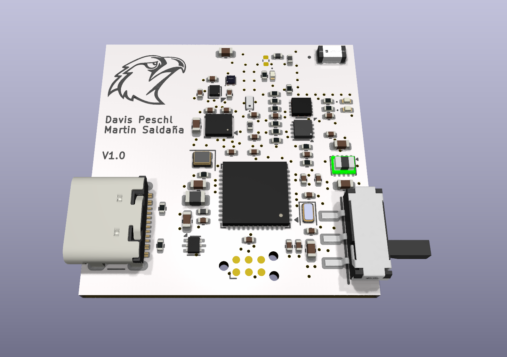
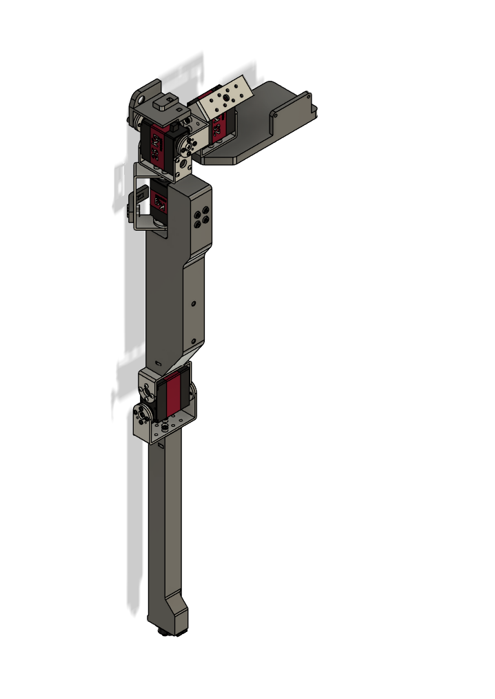
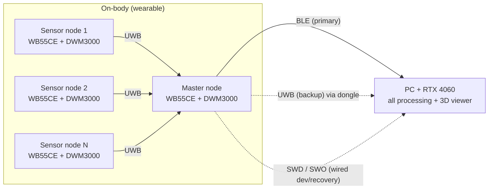
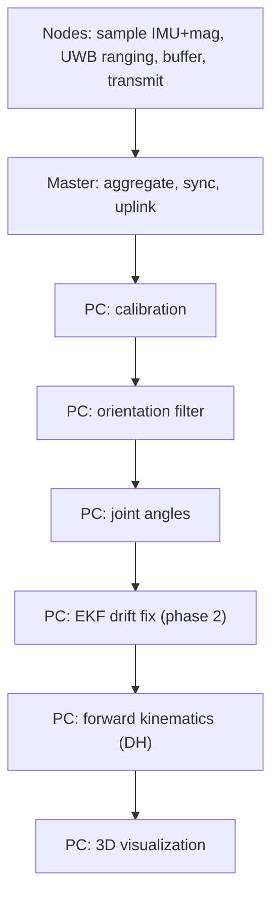
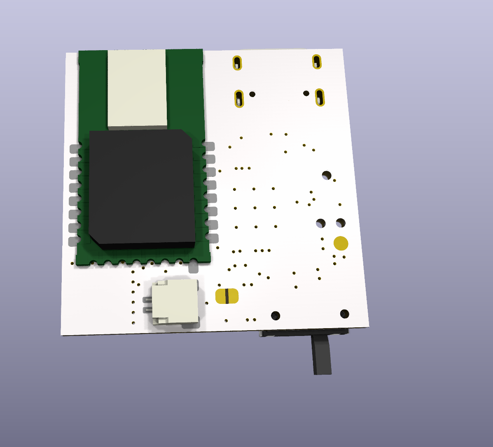
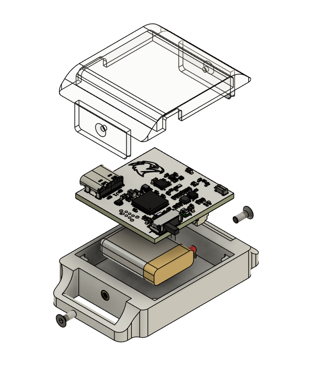
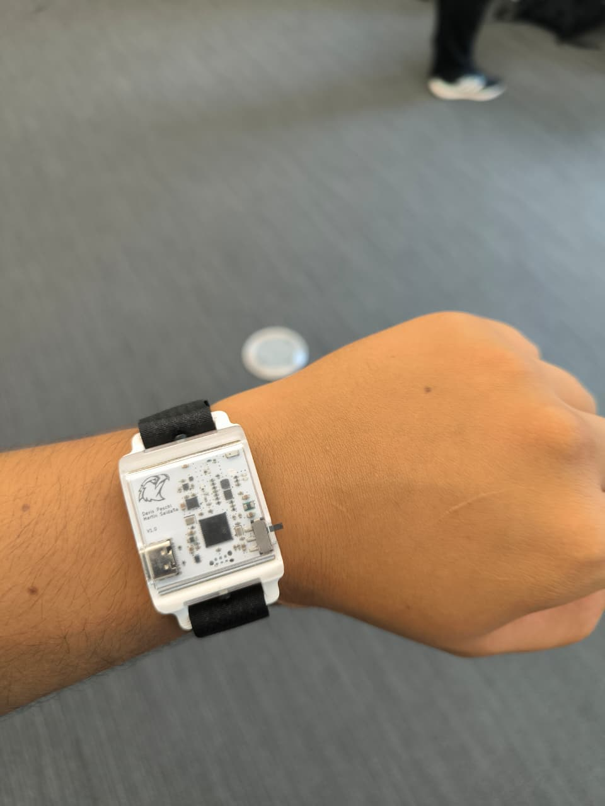

# Wearable IMU — Project Master README

> Wearable IMU-based motion-capture system for **live upper-limb pose estimation**.
> Summer research project (IIT Chicago), with the goal of publishing.
>
> This document is the single source of truth for the system architecture, hardware,
> communication design, processing pipeline, and repository structure. It is written
> so it can be handed to **Claude Code** (or any collaborator) to scaffold and build
> the project. See [How to use this document](#how-to-use-this-document) at the end.

### At a glance

| Node PCB (v1.0) | 5-DOF calibration / teleop rig |
|---|---|
|  |  |

**Left:** the wearable IMU node PCB (STM32WB55CEUx + DWM3000 + LSM6DSV16BXTR + BMM350).
**Right:** a separate parallel sub-project, [`test-rig/`](test-rig/README.md) — a
motorised 5-DOF arm used two ways: (1) **teleoperation demo**, driven live from the
wearable nodes, and (2) **calibration / ground truth**, moved through known joint
angles to validate the IMU pipeline's estimated angles against a known reference.

> **New to this project?** The actively maintained TODO / open-work list is
> [`docs/07-roadmap.md`](docs/07-roadmap.md) — start there to see what's done, what's
> open, and what's missing before picking up work.

---

## 1. Project overview

A network of small body-worn **IMU nodes** streams motion data to a **PC**, which reconstructs
and displays a live 3D skeleton of the upper limb. The design philosophy is **thin nodes,
heavy PC**: nodes only sample and transmit; all fusion, kinematics, and visualization run on
the PC (which has an RTX 4060 GPU).

| Item | Decision (v1) |
|------|----------------|
| Focus | Upper limb |
| Output | Live joint angles + 3D skeleton visualization |
| Nodes | Scalable design; initial bring-up on **2 confirmed nodes** (wrist, clavicle), a 3rd (chest) possible, scaling to **6–8** |
| Sample rate | **100 Hz** target (hardware capable to 200 Hz) |
| Environment | Lab / bench (PC present in the room) |
| Compute | All heavy processing on the PC, **not** on a body MCU |
| Reference work | *Ultra Inertial Poser* (UIP), SIGGRAPH 2024 — see [References](#10-references) |

---

## 2. System architecture

All nodes use **identical hardware** (STM32WB55CEUx + DWM3000). One node is designated the
**master** purely in firmware. Because the boards are identical, multiple transport
topologies can be tested and compared on the same hardware (a useful experimental result).

### Primary topology



- **On-body UWB network** carries node data to the master, provides **time sync**, and
  (phase 2) provides **inter-node ranging** for drift correction.
- **Master node** aggregates all node data and is the single uplink to the PC.
- **PC** runs the full pipeline and the live visualization.

### Where the work happens



> **v1 needs no Kalman filter.** Orientation → joint angles → DH skeleton → render is a
> complete working visualization. The EKF (with UWB distances) is a phase-2 enhancement
> for drift and position.

---

## 3. Transports & fallbacks

Every node has **two radios (BLE + UWB)**, giving multiple independent paths to the PC.
There is no onboard flash IC for session logging (see [Design decisions](#9-design-decisions-log-the-why))
— insurance against dropped data is RAM-buffering only. Layered strategy:

| Layer | Path | Role |
|-------|------|------|
| Live primary | BLE (master → PC, **host-native** Bluetooth — no dongle) | Main wireless link |
| Live backup | UWB → UWB-USB dongle | Independent RF path (different band) |
| Wired | **SWD / SWO** via ST-LINK, or native USB (CDC) | Bench/dev + data recovery |

Notes:
- BLE uses **serial-over-BLE** (a transparent UART-style GATT service / NUS-equivalent), so
  it behaves like a wireless UART. **Decided: host-native Bluetooth, no nRF52840 dongle** —
  simpler, one less part.
- **Debug/data connection is a TC2030-IDC footprint** — bare pogo-pin pads on the PCB, not a
  soldered connector. A separate Tag-Connect TC2030 cable/clip clamps onto those pads from
  outside the board (to an ST-LINK) to make contact. Carries SWDIO/SWDCLK/SWO; SWO gives a
  one-way MCU→PC data channel (read via SWV tooling).
- **USB-C carries both charging and native USB data.** The STM32WB55CEUx has native USB
  (unlike the STM32WBA55 originally assumed during design) — the firmware already has a
  USB CDC (virtual COM port) stack (`firmware/USB_Device/`). The current sensor bring-up
  smoke test is very likely read over this USB-CDC port with a serial monitor app, not over
  SWO — **this needs confirming and the docs/README reconciled once confirmed**, since a lot
  of earlier wording here assumed SWD/SWO was the only wired data path.
- RAM ring buffer (~seconds) covers jitter/retransmit; a >3–5 s dropout is treated as a
  compromised session regardless, so heavy persistence is unnecessary.

---

## 4. Hardware — Node BOM

Single identical board for every node. (No on-node SD card or flash IC — RAM buffering only.)

| Function | Part | Notes |
|----------|------|-------|
| MCU | **STM32WB55CEUx** (UFQFPN48) | Dual-core: Cortex-M4 @ 64 MHz (application) + Cortex-M0+ @ 32 MHz (radio stack), Bluetooth 5.4 LE + 802.15.4, 512 KB flash, 256 KB SRAM, native USB. Drives DWM3000 over SPI. |
| IMU | **LSM6DSV16BXTR** | 6-axis, onboard SFLP sensor fusion. **I2C1, addr `0x6B`** (SDO pulled high) |
| Magnetometer | **BMM350** | Separate 3-axis → makes the node 9-DOF. **Decided: using it for v1** (not yet implemented in firmware — see [§7](#7-build-phases--roadmap)). **I2C1, addr `0x14`** (ADSEL pulled low) |
| UWB | **DWM3000** | Data transport + sync + (phase-2) inter-node ranging. SPI1 (only SPI sensor on the node — IMU and mag are both I2C) |
| SMPS (+3V3) | **TPSM828224** | |
| Battery charger | **BQ25185** | Charges from USB-C VBUS |
| Fuel gauge | **MAX17048G_T10** | |
| Power button | **STM6601BM2DDM6F** | |
| USB-C | Right-angle 16P | Charging **and** native USB data (CDC stack present in firmware) |
| Debug/data | **TC2030-IDC footprint** (Tag-Connect) | Bare pogo-pin pads, no on-board connector — mates with a separate TC2030 cable/clip. SWD + SWO — data out / flash recovery |
| Indicator | LED | |
| Battery | LiPo, **120 mAh** | |

### PC-side hardware

| Function | Part | Notes |
|----------|------|-------|
| BLE receiver | **PC-native Bluetooth** | Decided: no nRF52840 dongle |
| UWB backup receiver | UWB-USB dongle (DWM3000 + USB MCU) | Optional, for the UWB fallback path |
| Compute | PC with **RTX 4060** | Runs full pipeline + visualization |

### Node PCB v1.0 — renders & board views

> Full detail (all four copper layers, schematic PDF, fab files) lives in
> [`hardware/electronics/v1.0/`](hardware/electronics/v1.0/README.md).
> Known antenna keepout issue on the DWM3000 — see [§7](#7-build-phases--roadmap) for the
> decision on whether that becomes a v1.1 bug-fix spin or gets folded into a v2.0 redesign,
> pending v1.0 bring-up results. See also
> [`hardware/electronics/CHANGELOG.md`](hardware/electronics/CHANGELOG.md).

| PCB 3D — top | PCB 3D — bottom |
|---|---|
|  |  |

| Assembled (exploded) | Worn on wrist |
|---|---|
|  |  |

---

## 5. Communication & protocols

### Data format (per node, per sample)
- **Option A (preferred for the rig): raw 9-DOF** — accel(3) + gyro(3) + mag(3) + timestamp.
  Maximum flexibility; host does all fusion. ~40 bytes/sample.
- **Option B: SFLP quaternion** (from the LSM6DSV16B) + raw mag. Smaller, less host work.
- **Decision: open** (see [Open items](#11-open-items)). Magnetometer rate can be lower
  (e.g., 50–100 Hz).

> Bandwidth budgeting and UWB TDMA scheduling design used to be spelled out here with
> specific numbers, but neither BLE nor UWB has actually been tested on hardware yet — those
> numbers were pre-hardware-test estimates, not decisions. They now live in
> [`docs/04-firmware.md`](docs/04-firmware.md#tdma-frame-planned--not-implemented) (UWB
> scheduling/sync) and [`docs/03-communication.md`](docs/03-communication.md#6-bandwidth-check)
> (bandwidth), clearly marked as unvalidated estimates rather than settled numbers.

---

## 6. Processing pipeline (PC)

| Stage | Purpose | Maps to known technique |
|-------|---------|--------------------------|
| 0. Calibration | Sensor-to-segment alignment (T/N-pose) | — |
| 1. Orientation filter | accel+gyro(+mag) → world-frame quaternion | complementary / Madgwick / VQF (or use SFLP) |
| 2. Joint angles | relative rotation between adjacent segments | rotation matrices / quaternions |
| 3. EKF (phase 2) | fuse UWB inter-node distances → fix drift / get positions | Kalman filter (new) |
| 4. Forward kinematics | joint angles + segment lengths → 3D skeleton | **Denavit-Hartenberg** |
| 5. Visualization | live render of links/joints | 3D viewer |

- **v1 path:** stages 0 → 1 → 2 → 4 → 5 (no EKF).
- **Phase 2:** insert stage 3 (EKF + UWB ranging) for drift/position.
- A **synthetic data generator** (or arm-simulator rig) can drive the pipeline before
  hardware is ready.

---

## 7. Build phases / roadmap

1. **Firmware + data path** — node sampling, UWB schedule, master aggregation, PC ingest.
   Bring up over **SWD/SWO (wired)** first (familiar tooling), then add BLE as a parallel path.
2. **Visualization program** — orientation → joint angles → DH skeleton → live 3D render.
   Develop against **synthetic data** first. No Kalman filter needed.
3. **EKF** — learn the Kalman filter (from complementary-filter intuition) and fold in the
   UWB inter-node distances for drift/position.

> BLE de-risking: prove the entire system over wired (SWD/SWO) first; learn BLE in isolation
> on a NUCLEO-WB55RG with ST's serial-over-BLE example; then integrate with the wired path
> still available as a safety net.

### Parallel workstream — 5-DOF arm / test rig

A 5-DOF robotic arm mirroring human upper-limb kinematics. It's a single physical
rig serving **two purposes**:

1. **Teleoperation demo** — drive the arm live from the wearable IMU nodes.
2. **Calibration / ground-truth measurement** — move the arm through known joint
   angles and compare against the IMU pipeline's estimated angles, to quantify
   filter error.


Status: forward kinematics validated (MATLAB GUI); inverse kinematics implemented
but not yet validated; mechanical CAD for the rig itself in progress. Full detail
in [`docs/07-roadmap.md`](docs/07-roadmap.md#parallel-workstream--5-dof-arm-teleoperation--calibration-rig)
and [`test-rig/README.md`](test-rig/README.md).

---

## 8. Repository structure

Actual current tree (not aspirational — status noted per folder):

```
wearable-imu/
├── README.md                      # this file
├── CONTRIBUTING.md                # branch/tag/versioning conventions
├── docs/                          # markdown source of truth, one file per section
│   ├── 01-system-overview.md
│   ├── 02-hardware.md
│   ├── 03-communication.md        # authoritative wire protocol spec
│   ├── 04-firmware.md             # firmware architecture: CubeMX project + smoke test are
│   │                               #   real; packet/comms application layer still planned
│   ├── 05-host-pipeline.md
│   ├── 06-calibration.md
│   ├── 07-roadmap.md              # build phases, real done/not-done status, open items
│   └── 08-appendices.md
│
├── firmware/                      # STM32CubeIDE project for the STM32WB55CEUx node
│   ├── Core/                      # CubeMX-generated (HAL, startup, clock) — do not hand-edit
│   ├── Drivers/                   # CMSIS + STM32WBxx HAL
│   ├── Middlewares/ST/            # ST middleware
│   ├── ThirdParty/                # BMM350, lsm6dsv16bx vendor drivers
│   ├── USB_Device/                # USB CDC (virtual COM port) stack — native USB, not charging-only
│   └── *.ioc / *.ld               # CubeMX config + linker scripts
│   (application logic — packet serializer, UWB TDMA, BLE serial, role state
│    machines — not written yet; see docs/07-roadmap.md)
│
├── host/                          # Python package — the live PC pipeline
│   └── wearable_imu/
│       ├── ingest/                # serial / SWO readers + wire protocol codec (real, tested)
│       ├── sync/                  # timebase alignment
│       ├── orientation/           # filters (complementary / Madgwick / VQF) — stub
│       ├── kinematics/            # joint angles + DH forward kinematics — stub
│       ├── ekf/                   # phase 2: UWB-distance fusion — stub
│       ├── viz/                   # 3D skeleton viewer — stub
│       ├── sim/                   # synthetic data generator (real, drives dev without hardware)
│       ├── config.py
│       └── main.py
│
├── hardware/                      # physical design files — only place with version folders
│   ├── electronics/v1.0/          # node PCB: schematic, layout, fab files, renders
│   └── mechanical/v1.0/           # node enclosure: STEP/STL, assembly renders
│
├── simulation/scripts/            # 5-DOF arm kinematics (MATLAB) — FK validated, IK
│                                   # implemented pending validation. Not yet cross-linked
│                                   # into test-rig/ below.
├── test-rig/                      # ground-truth validation rig — mostly planned
│   └── hardware/mechanical/v1.0/  # rig arm CAD — in progress (the only real part so far)
│
├── calibration/                   # calibration routines + saved profiles — planned
└── tools/                         # flash/capture/calibrate/replay scripts — planned
```

---

## 9. Design decisions log (the "why")

- **Sensor selection, generally:** across the BOM, the guiding principle was to pick the
  most capable part available in its class at design time, not the cheapest one that
  technically works — this is a research/publication project, not a cost-optimized
  product, so headroom (accuracy, noise floor, ranging precision) was prioritized over
  BOM cost. The three sensing ICs below were each chosen on that basis:
  - **IMU = LSM6DSV16BXTR:** one of ST's most capable 6-axis parts at selection time —
    onboard SFLP (Sensor Fusion Low Power) hardware fusion can offload orientation
    estimation from the host, but is bypassable for a raw-data path if the host EKF is
    preferred instead. High ODR headroom (only 120 Hz is used here).
  - **Magnetometer = BMM350:** chosen for resolution/noise performance over cheaper
    3-axis parts, making the node 9-DOF. Populated on every board, but use is **optional**
    pending characterization of the lab's magnetic environment — indoor steel/motors can
    make magnetometer data actively worse than leaving it out.
  - **UWB = DWM3000:** the most capable UWB module available for this application —
    supports the newer 802.15.4z standard (better multipath resistance) with strong
    ranging accuracy. Chosen as the **sole radio** on the node: it replaces what would
    otherwise be a separate ranging radio, handling data transport, sub-ns time sync,
    and inter-node ranging in one part.
- **MCU = STM32WB55CEUx** (over the earlier L431 / U535): the master needs BLE; identical
  BLE-capable boards let any node be master and enable topology testing. Dual-core
  (Cortex-M4 app core + Cortex-M0+ radio stack core), ultra-low-power (good for a small
  battery), and has native USB (unlike the STM32WBA55 originally assumed during design —
  see the note in [§3](#3-transports--fallbacks) about reconciling the SWD/SWO-vs-USB wired
  data path now that native USB is actually available).
- **Master-aggregator + single BLE uplink** (vs UIP's per-node BLE): one BLE link instead of
  N (avoids PC multi-link flakiness) and gives tighter on-body sync.
- **BLE primary + UWB backup:** two independent RF paths. BLE (2.4 GHz) is more robust to
  body blocking than UWB (6.5–8 GHz); UWB is reserved for ranging where it's irreplaceable.
- **PC does all heavy compute** (not a body MCU): the pipeline (and future ML) is GPU/
  desktop work, and PC-side iteration is far faster than reflashing firmware.
- **No on-node SD card or flash IC:** RAM buffer only; avoids tedious card extraction, and
  the fabricated v1.0 board doesn't populate a flash chip at all — recovery happens over
  SWD (or USB, pending the reconciliation above).
- **100 Hz for v1:** matches UIP and is sufficient for full-body pose; keeps BLE bandwidth
  comfortable.

---

## 10. References

- **[Ultra Inertial Poser (UIP), SIGGRAPH 2024](https://siplab.org/projects/UltraInertialPoser)**
  (Armani, Qian, Jiang, Holz — [ACM DL](https://dl.acm.org/doi/10.1145/3641519.3657465),
  [code](https://github.com/eth-siplab/UltraInertialPoser)) — sparse body-worn IMU + UWB
  inter-node ranging, fused on a host with VQF orientation, per-pair EKF, an LSTM + graph-conv
  network, and a physics dynamics optimizer to produce full-body pose.
  - **This project mirrors** the IMU + UWB sensing approach and the "thin nodes, host does
    the work" philosophy.
  - **This project differs:** adds a magnetometer (9-DOF vs UIP's 6-DoF); uses a
    master-aggregator UWB→BLE topology (vs UIP's per-node BLE to host); focuses on upper-limb
    joint angles + live visualization for v1; EKF/ranging is a phase-2 enhancement.

---

## 11. Open items

**The actively maintained TODO / open-work list lives in
[`docs/07-roadmap.md`](docs/07-roadmap.md)** — its "Open items", "Hardware revisions", and
"Known gaps" sections are the source of truth for what's decided, what's still open, and
what's missing (including firmware, UWB/BLE testing, the test-rig end-effector adapter, and
the onboarding doc for new students). This section is intentionally just a short pointer
rather than a second list, to avoid the two drifting out of sync.

Top-level decisions still open, at a glance:
- **Data format:** raw 9-DOF vs SFLP quaternion + raw mag.
- **Magnetometer:** whether to use it (characterize the lab's magnetic environment first;
  hardware is populated either way).
- **Battery:** final capacity (300–600 mAh).
- **Sample rate:** confirm 100 Hz (vs 200 Hz).
- **Dongle:** PC-native BLE vs nRF52840 dongle; whether to build the UWB backup dongle.

---

## How to use this document

1. Keep this README and the `docs/` folder as the **markdown source of truth** (version with
   git). Use **Mermaid** for all diagrams so they edit as text and render in GitHub/VS Code.
2. To produce a polished copy for the team/professor, export markdown → Word/PDF (e.g., with
   Pandoc, which renders the Mermaid diagrams to images). Don't hand-maintain two copies.
3. To scaffold the project, hand this file to **Claude Code** and ask it to create the
   repository structure in [Section 8](#8-repository-structure-proposed), generating stub
   files with the responsibilities described here.
4. Build in the phase order of [Section 7](#7-build-phases--roadmap): wired data path first,
   then visualization (synthetic data), then BLE, then the EKF.
5. **Looking for what to work on next?** Don't rely on this README's [Open items](#11-open-items)
   list alone — [`docs/07-roadmap.md`](docs/07-roadmap.md) is the actively maintained TODO
   tracker and is more current.
