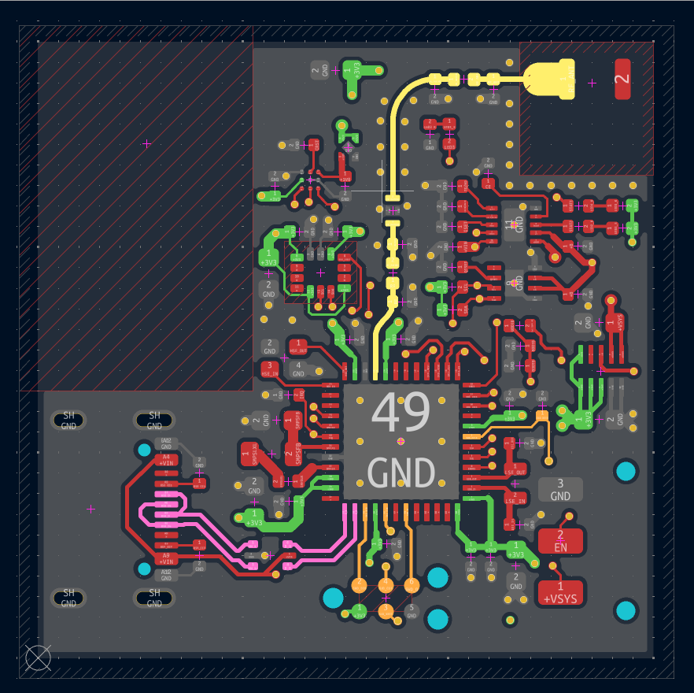
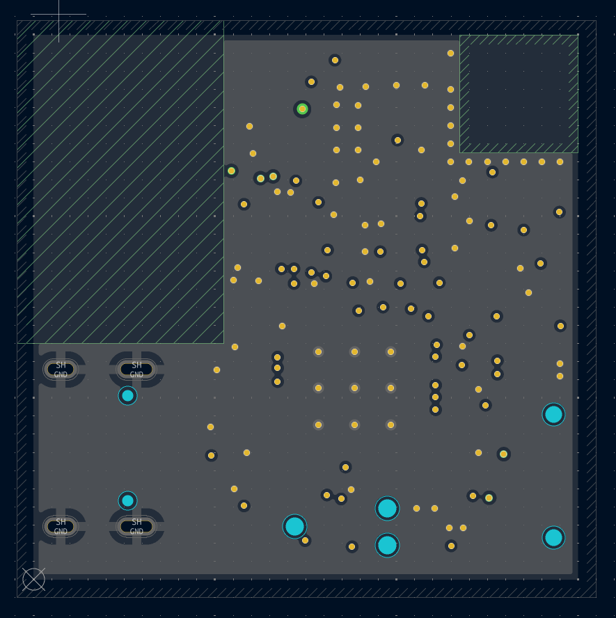
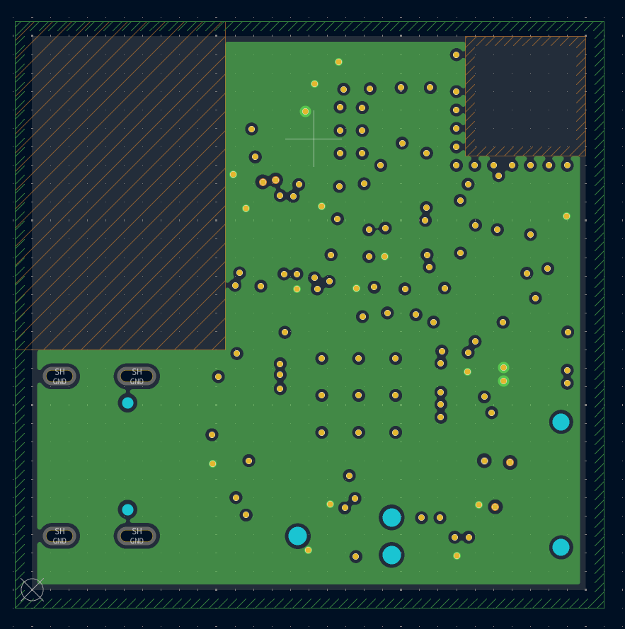
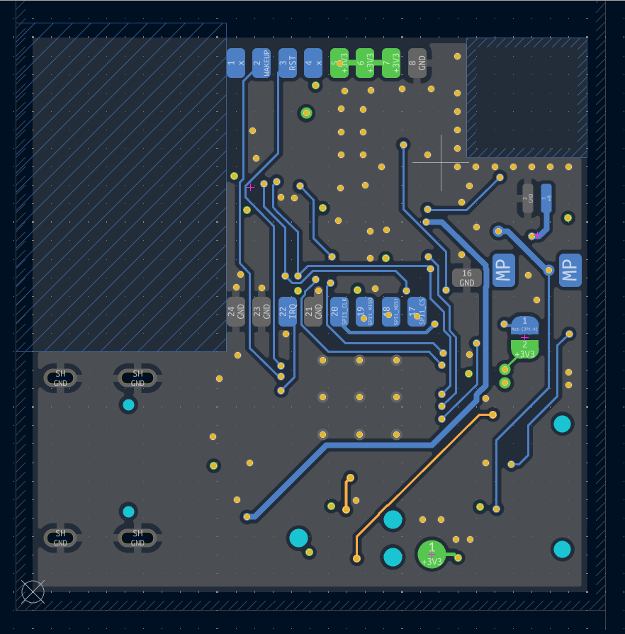

# electronics / v1.0

Node PCB — revision 1.0. 4-layer board (F.Cu, In1.Cu, In2.Cu, B.Cu).

> **Known issue, fix path pending v1.0 evaluation:** the DWM3000 UWB antenna
> placement doesn't fully follow Qorvo's layout guidelines (clearance/keepout,
> feed line length), which may affect range/link margin. Whether this becomes a
> v1.1 placement-only fix or gets folded into a v2.0 redesign depends on how
> v1.0 performs in bring-up. See `../CHANGELOG.md` and `docs/07-roadmap.md`.

## Contents

- `wearable_IMU.kicad_sch` — schematic (source)
- `wearable_IMU.kicad_pcb` — layout (source)
- `wearable_IMU.kicad_pro` / `.kicad_prl` — project files
- `documentation/` — exported images (below) + `schematic.pdf`
- `jlcpcb/` — fab outputs: `gerber/` (raw Gerbers + drill files), `production_filesV1.0/`
  (BOM, pick-and-place, zipped Gerbers — the JLCPCB submission set), `project.db`
- `fabrication-toolkit-options.json` — KiCad fabrication-toolkit plugin export settings
- The PCB's 3D model (`PCB.step`) lives in `../../mechanical/v1.0/` alongside the
  enclosure — kept in one place instead of duplicated here

Cleaned up (untracked, safe to regenerate/ignore): KiCad's local autosave/history
folders (`.history/`, `.history_trim/` — an embedded git history plugin, ~290 MB),
`wearable_IMU-backups/` (autosave zips), a stale `production/` test export
("prueba1"), an empty `jlcpcb/production_files/`, 0-byte `.rpt` temp files, and
KiCad's `.lck` lock files. Added patterns to `.gitignore` so these don't come back.

## Key parts

Straight from the fabricated board's BOM (`jlcpcb/production_filesV1.0/BOM-wearable_IMU.csv`):

| Function | Part |
|----------|------|
| MCU | STM32WB55CEUx |
| IMU | LSM6DSV16BXTR |
| Mag | BMM350 |
| UWB | DWM3000 |
| SMPS | TPSM828224 |
| Charger | BQ25185 |
| Fuel gauge | MAX17048G+T10 |
| Power btn | STM6601BM2DDM6F |

No flash IC is populated — RAM buffering only, no on-node session logging.

## Fabrication

Board fabricated and assembled via **JLCPCB** (PCBA — SMT assembly included, not just bare
board fab). Production files were exported from KiCad using the **fabrication-toolkit**
plugin (`fabrication-toolkit-options.json` holds its export settings).

To re-order or fab a new revision:
1. Open `wearable_IMU.kicad_pro` in KiCad, update as needed.
2. Run the fabrication-toolkit plugin to regenerate `jlcpcb/production_filesV1.0/` (or a new
   `production_filesVX.Y/` for a new revision) — Gerbers, `BOM-wearable_IMU.csv`,
   `CPL-wearable_IMU.csv` (component placement).
3. Upload the zipped Gerbers + BOM + CPL to JLCPCB's PCBA order flow.

## Board renders & layers

**3D views**

| Top | Bottom |
|---|---|
|  |  |

**Copper layers** (top → bottom of stack)

| F.Cu (top) | In1.Cu | In2.Cu | B.Cu (bottom) |
|---|---|---|---|
|  |  |  |  |

**Schematic:** [`documentation/schematic.pdf`](documentation/schematic.pdf)
