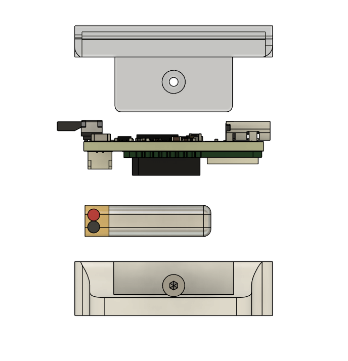
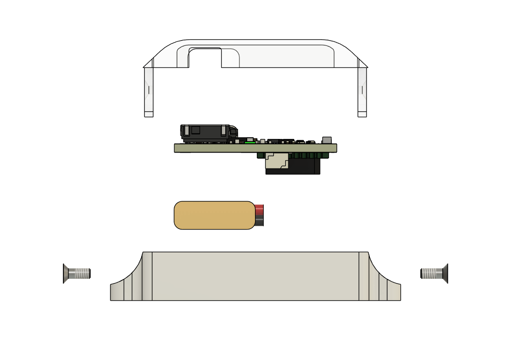

# mechanical / v1.0

Node enclosure — revision 1.0.

## Contents

- `PCB.step` — PCB STEP file (for ECAD/enclosure co-design)
- `CASE.stl`, `case1.stl` — enclosure, 3D-printable

## Assembly

| Orthographic (front/top/side) | Exploded (isometric) | Exploded (lateral) |
|---|---|---|
|  |  |  |

**On device:**

## Design notes

3-part shell (top cover + base) with strap slots, USB-C cutout, and a
power-button cutout. Case + battery + PCB assemble as shown above.

TODO: dimensions writeup, mounting/strap interface details, connector cutout
tolerances.
